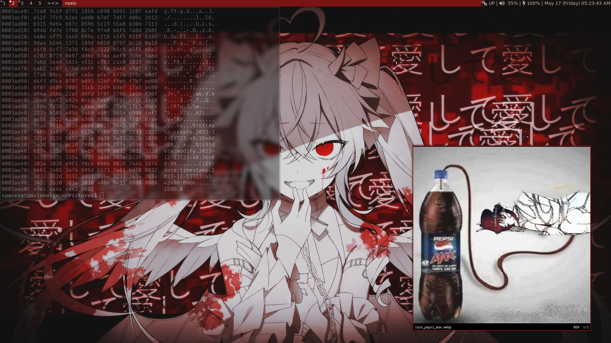

## Dotfiles
My collection of minimal configuration files, simple as.
## System Information:
* OS: [Void Linux](https://voidlinux.org/)
* Terminal Emulator: [st](https://st.suckless.org/)
* WM: [dwm](https://dwm.suckless.org/) w/ [slstatus](https://tools.suckless.org/slstatus/)
* Compositor: [picom](https://github.com/yshui/picom)
## How it will look:

## Notes:
For special characters to show up in slstatus, [download fontawesome](https://fontawesome.com/), and place the file in /usr/share/fonts/truetype. If the truetype directory isn't already created, use mkdir.
