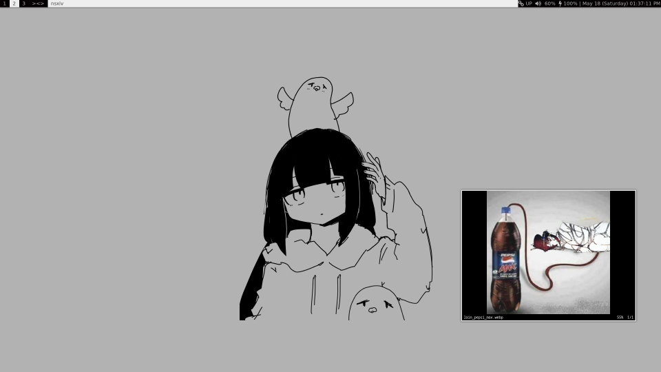

## Dotfiles
My collection of minimal configuration files, simple as.
## System Information:
* OS: [Void Linux](https://voidlinux.org/)
* Terminal Emulator: [st](https://st.suckless.org/)
* WM: [dwm](https://dwm.suckless.org/) w/ [slstatus](https://tools.suckless.org/slstatus/)
* Compositor: [picom](https://github.com/yshui/picom)
## How it will look:

## Dependencies for Void:
'$ xbps-install -S base-devel libX11-devel libXft-devel libXinerama-devel git make xwallpaper grep awk'
## Notes:
* Open Fonts, and place 'opentype' and 'truetype' in /usr/share/fonts. If the two directories are already created, just place the two files in their respected, already created, directories.
* More will be added soon :<
